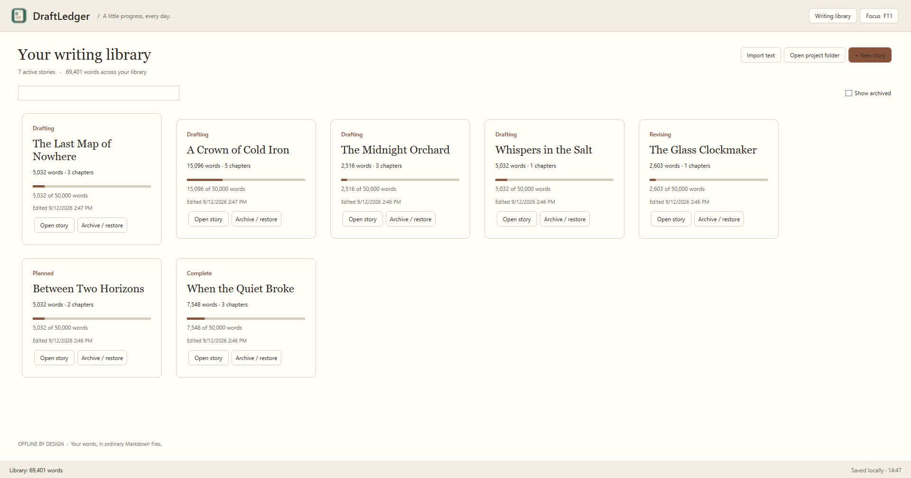
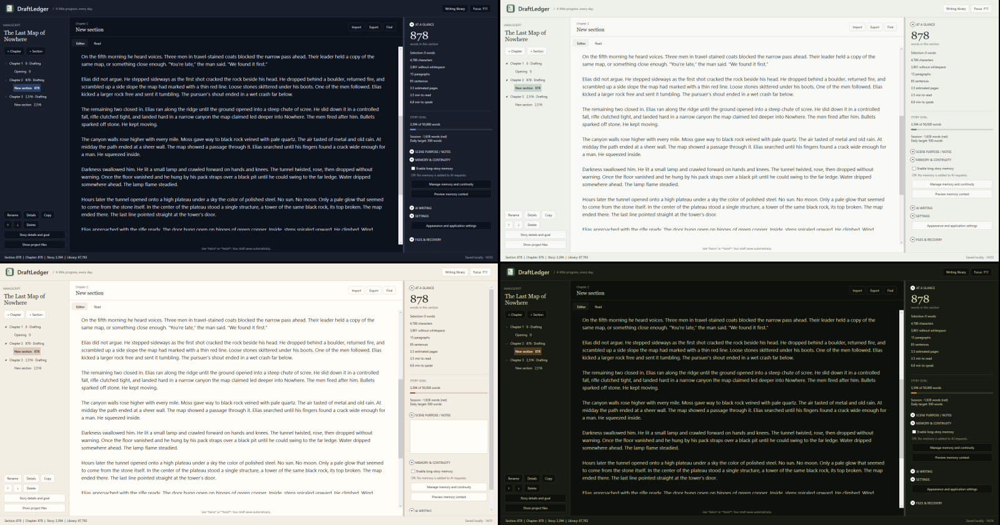
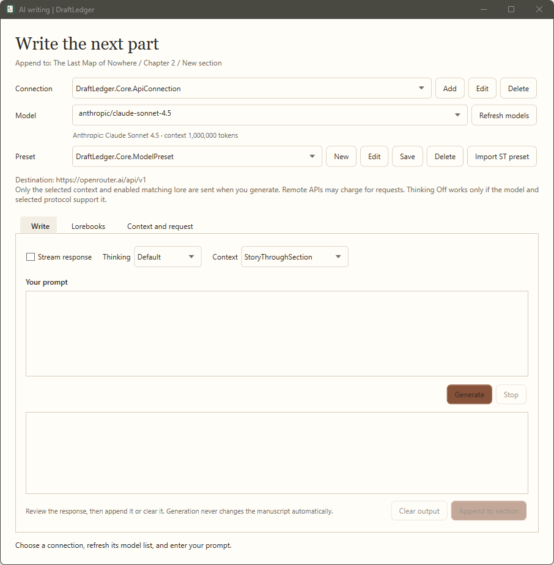
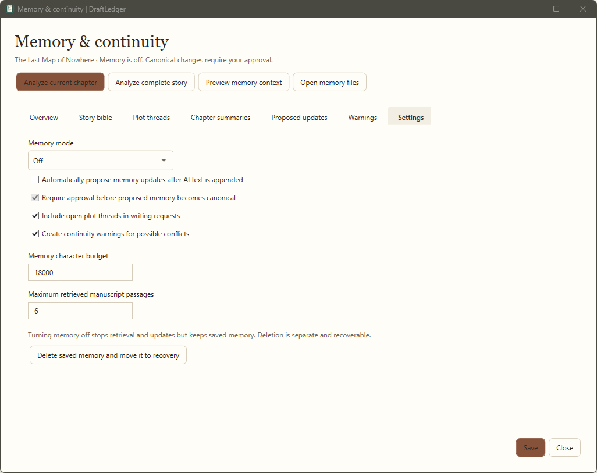

# DraftLedger

**A lightweight, offline-first writing workspace for Windows.**

[](https://github.com/Upfront5771/DraftLedger/actions/workflows/build.yml)
[](https://github.com/Upfront5771/DraftLedger/releases/latest)
[](#system-requirements)
[](#privacy-and-storage)

DraftLedger organizes long-form writing into stories, chapters, and sections. Manuscripts stay on your computer as readable Markdown files. The application works without an account, browser component, cloud service, or internet connection.

AI writing features are optional. Connect OpenAI, OpenRouter, LM Studio, or another OpenAI-compatible API when you want generation, synopsis assistance, lorebooks, or long-story memory support.

[Download the latest Windows release](https://github.com/Upfront5771/DraftLedger/releases/latest) · [Read the user guide](docs/USER-GUIDE.md) · [View release notes](docs/RELEASE-NOTES.md)

## Screenshots

Current screenshots of the main workspace, themes, AI writing, and long-story memory:

| Main writing workspace | Themes |
| --- | --- |
|  |  |
| **AI writing** | **Memory and continuity** |
|  |  |

## Highlights

### Writing workspace

- Organize manuscripts into stories, chapters, and sections
- Write or paste Markdown in the Editor and view formatted prose in Preview
- Live section, chapter, story, and library word counts
- Search and replace within the current story
- Eleven themes, expanded font choices, spell checking, and full-width focus mode
- Wider resizable right pane with collapsible tools
- Automatic saving, snapshots, conflict copies, and portable ZIP backups
- Import and export plain text and Markdown

### Optional AI writing

- OpenAI, OpenRouter, LM Studio, and custom OpenAI-compatible connections
- Searchable provider model lists
- Reusable connection and generation presets
- Full-page Input, Output, Lorebooks, and Context / Request tabs beside Editor and Preview
- Inline model-preset editing in the API Connections window
- Windows-encrypted API-key storage
- Streaming, cancellation, and supported reasoning controls
- SillyTavern chat-completion preset and lorebook imports
- Editable generated output that is never appended automatically
- One-paragraph story synopsis generation
- Request preview without credentials

### Optional long-story memory

Long-story memory is disabled by default and enabled separately for each story.

- Editable story-so-far summary and style guide
- Story bible with lockable canonical facts
- Open plot-thread tracking
- Chapter summaries with stale-summary detection
- Continuity and contradiction warnings
- Local retrieval of relevant earlier manuscript passages
- Chapter-sized analysis for manuscripts that exceed one model context window
- Editable proposals that require writer approval
- Preview of the exact memory context selected for a request
- Portable JSON and Markdown memory files inside the project folder

Local retrieval uses section boundaries, keywords, exact names, and recency. It does not require an embedding API or vector database.

## Installation

1. Open the [latest release](https://github.com/Upfront5771/DraftLedger/releases/latest).
2. Download `DraftLedger-win-x64.zip`.
3. Extract the complete ZIP to a writable folder.
4. Run `DraftLedger.exe`.

Do not run the executable from inside the ZIP. The release is self-contained, so a separate .NET installation is not required.

This preview is not digitally signed. Windows SmartScreen may show a warning the first time it opens.

## System requirements

- Windows 10 or Windows 11, 64-bit
- Intel or AMD x64 processor
- 4 GB RAM minimum, 8 GB recommended
- Approximately 200 MB of available storage, plus manuscript and backup space
- 1280 × 720 display minimum, 1920 × 1080 recommended
- Standard Windows user account
- Internet only when using a remote AI provider

LM Studio can provide local generation without sending manuscript content to a remote provider. Its hardware requirements depend on the selected model.

## Privacy and storage

- No DraftLedger account, telemetry, advertising, or background network service
- Manuscripts stored locally as ordinary UTF-8 Markdown files
- Project metadata, memory, snapshots, and recovery files remain portable
- API keys encrypted for the current Windows user using Windows Data Protection
- Remote providers receive only the content included in a user-started request
- No browser impersonation, automatic retries, or hidden AI requests

Each story uses a portable structure similar to:

```text
My Story/
├── project.json
├── chapters/
│   └── <chapter-id>/
│       └── <section-id>.md
├── memory/
│   ├── memory.json
│   ├── story-bible.md
│   ├── story-so-far.md
│   └── open-threads.md
├── backups/
└── recovery/
```

## Build from source

Install the [.NET 10 SDK](https://dotnet.microsoft.com/download/dotnet/10.0) on Windows, then run:

```powershell
./scripts/build-windows.ps1
```

The script runs the cross-platform core tests, Windows WPF regression tests, and publishes a self-contained package to:

```text
artifacts/DraftLedger-win-x64.zip
```

For development:

```powershell
dotnet run --project src/DraftLedger.App/DraftLedger.App.csproj
```

For Windows ARM64:

```powershell
./scripts/build-windows.ps1 -Runtime win-arm64
```

## Automated validation

Every push and pull request runs the Windows build workflow. It executes the core tests, native WPF regression tests, and produces a downloadable build artifact.

DraftLedger 0.3.2 passed **103 automated checks** with zero build warnings or errors. See [the validation record](docs/VALIDATION.md) for covered behavior and remaining interactive Windows checks.

## Repository layout

| Path | Purpose |
| --- | --- |
| `src/DraftLedger.Core` | Storage, statistics, memory, retrieval, AI request preparation, and provider client |
| `src/DraftLedger.App` | Native WPF interface, editor, settings, and Windows credential protection |
| `tests/DraftLedger.Tests` | Cross-platform functional and contract tests |
| `tests/DraftLedger.WpfTests` | Windows-native WPF regression tests |
| `docs` | User guide, release notes, architecture, screenshots, and validation |
| `scripts` | Windows build and packaging automation |

## Project status

DraftLedger is an unsigned preview. Use backups and keep another copy of important manuscripts while testing.

Planned areas include Word/RTF import, Word/PDF export, chapter detection, writing history, richer character and location records, analysis tools, and additional focus features.

## Contributing

Bug reports and feature requests are welcome through [GitHub Issues](https://github.com/Upfront5771/DraftLedger/issues). Include the DraftLedger version, Windows version, reproduction steps, and any relevant error message. Do not include API keys or private manuscript text.

The repository does not currently declare an open-source license. Public visibility alone does not grant redistribution or modification rights.
